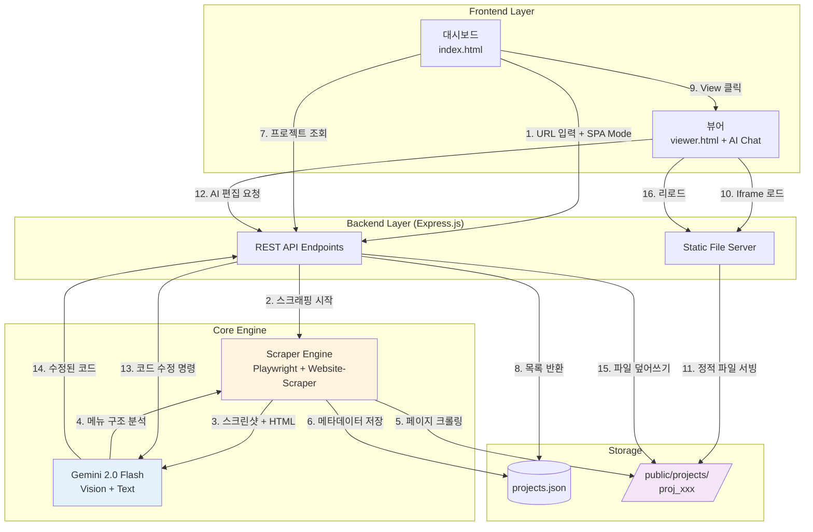

# 🕸️ AI 기반 지능형 웹 사이트 클로너 (ScraperPark)

이 프로젝트는 **Node.js**와 **Playwright**, 그리고 **Google Gemini 1.5 Pro**를 결합한 하이브리드 웹 사이트 복제 및 편집 시스템입니다.
단순한 정적 수집을 넘어, SPA(Single Page Application)의 동적 콘텐츠를 해석하고 AI Vision을 통해 메뉴 구조를 파악하며, 복제된 사이트를 대화형 AI로 즉시 수정할 수 있습니다.

---

## 🛠 기술 스택 (Tech Stack)

### Backend
- **Runtime**: Node.js
- **Framework**: Express.js (REST API 및 정적 파일 서빙)
- **Engine**: 
  - `playwright`: 브라우저 자동화 및 동적 상호작용
  - `website-scraper`: 리소스(HTML/CSS/IMG) 다운로드 및 경로 재작성
  - `puppeteer`: 보조 렌더링 엔진

### Frontend (Dashboard & Viewer)
- **Core**: Vanilla JavaScript (ES6+)
- **Styling**: Tailwind CSS (PostCSS)
- **AI Integration**: Gemini 1.5 Pro (via Google Generative AI SDK)

### AI & Intelligence
- **Model**: Gemini 2.0 Flash (Google Generative AI)
- **Vision Analysis**: 스크린샷 기반 메뉴 구조 파악 및 DOM 분석
- **Code Generation**: 자연어 요청을 HTML/CSS 코드로 변환하여 실시간 파일 수정
- **Context Awareness**: 멀티모달 분석으로 HTML + CSS 구조 인식

---

## 🏗 시스템 아키텍처 (Architecture)



---

## 📂 폴더 구조 (Directory Structure)

```
ScraperPark/
├── .env                  # 환경변수 (GEMINI_API_KEY)
├── server.js             # Express 서버 (REST API, AI 편집 엔드포인트)
├── scraper.js            # 스크래핑 엔진 (Playwright + Gemini Vision)
├── package.json          # 의존성 및 빌드 스크립트
├── tailwind.config.js    # Tailwind CSS 설정
│
├── public/               # 정적 파일 서빙 디렉토리
│   ├── index.html        # 메인 대시보드 (프로젝트 관리 UI)
│   ├── viewer.html       # 프로젝트 뷰어 + AI 채팅 에디터
│   ├── ai-editor.js      # [레거시] 독립 AI 에디터 스크립트
│   ├── styles.css        # 컴파일된 Tailwind CSS
│   ├── favicon.svg       # 파비콘
│   └── projects/         # 복제된 웹사이트 저장소
│       ├── projects.json # 프로젝트 메타데이터 DB
│       └── proj_xxx/     # 개별 프로젝트 폴더
│
├── styles/
│   └── input.css         # Tailwind 소스 파일
│
├── test/                 # 테스트 및 가이드라인
│   ├── components/       # 테스트용 컴포넌트
│   └── guidelines/       # 개발 가이드
│
└── node_modules/         # npm 패키지
```

---

## 📦 사용된 주요 오픈소스 (Open Source)

| 패키지명 | 용도 | 비고 |
|---|---|---|
| **express** | 웹 서버 프레임워크 | API 및 라우팅 처리 |
| **playwright** | 브라우저 자동화 | SPA 크롤링, 스크린샷, 이벤트 제어 |
| **@google/generative-ai** | AI 모델 연동 | Gemini 1.5 Pro (Vision/Text) |
| **website-scraper** | 사이트 다운로드 | 정적 자산(CSS/IMG) 링크 처리 |
| **fs-extra** | 파일 시스템 확장 | 비동기 파일 조작 |
| **dotenv** | 환경 변수 관리 | API 키 보안 |
| **archiver** | 압축 유틸리티 | 결과물 ZIP 다운로드 제공 |

---

## 🚀 설치 및 실행 (Installation & Usage)

### 1. 의존성 설치
```bash
npm install
```

### 2. 환경 변수 설정
루트 디렉토리에 `.env` 파일을 생성하고 Gemini API 키를 입력하세요.
```env
GEMINI_API_KEY=your_google_gemini_api_key
```
> **API 키 발급**: [Google AI Studio](https://aistudio.google.com/app/apikey)에서 무료로 발급 가능

### 3. 서버 실행
```bash
npm start
```
- Tailwind CSS 자동 빌드 후 서버 시작
- 서버 주소: `http://localhost:3000`

### 4. 사용 방법
1. 브라우저에서 `http://localhost:3000` 접속
2. 대시보드에서 복제할 URL 입력 (예: `example.com`)
3. **SPA Mode** 체크박스 선택 (동적 사이트의 경우)
4. **Start Scraping** 클릭하여 복제 시작
5. 완료 후 프로젝트 카드에서 **View** 클릭
6. 뷰어 우측 하단 AI 채팅에서 실시간 편집 가능

---

## ✨ 주요 기능 (Key Features)

1.  **하이브리드 스크래핑**: 정적 다운로드와 동적 SPA 크롤링의 장점을 결합하여 완벽에 가까운 복제율 자랑.
2.  **AI 시각적 메뉴 탐지**: HTML 구조가 난해해도, AI가 스크린샷을 보고 "사람처럼" 메뉴를 찾아내어 숨겨진 페이지까지 수집.
3.  **대량 심층 크롤링**: 발견된 링크를 Queue에 담아 설정된 깊이만큼 자동으로 탐색 (기본 50페이지).
4.  **AI 인-페이지 에디터**: 복제된 사이트 우측 하단에 AI 채팅창 제공. "배경을 빨간색으로 바꿔줘"라고 말하면 즉시 코드 수정.
5.  **오탐지 방지 시스템**: 거리, 크기, 위치 기반의 정교한 필터링으로 광고나 배너를 메뉴로 착각하는 오류 최소화.

---

## 🔌 API 엔드포인트 (API Endpoints)

### 프로젝트 관리
- **GET** `/api/projects` - 전체 프로젝트 목록 조회
- **DELETE** `/api/projects/:id` - 특정 프로젝트 삭제

### 스크래핑
- **POST** `/api/scrape` - 새 웹사이트 복제 시작
  ```json
  {
    "url": "example.com",
    "spaMode": true
  }
  ```

### 파일 관리
- **GET** `/api/files?projectId=xxx` - 프로젝트 파일 트리 조회
- **POST** `/api/download` - 선택 파일/폴더 ZIP 다운로드
  ```json
  {
    "projectId": "proj_xxx",
    "files": ["index.html", "assets/css/style.css"]
  }
  ```

### AI 편집
- **POST** `/api/ai-edit` - AI 기반 코드 수정
  ```json
  {
    "projectId": "proj_xxx",
    "filePath": "index.html",
    "instruction": "배경색을 파란색으로 변경해줘"
  }
  ```

### 뷰어
- **GET** `/view/:projectId` - 프로젝트 뷰어 페이지 (AI 채팅 포함)

---

## 💡 고급 기능 (Advanced Features)

### 1. 멀티 디바이스 프리뷰
- 뷰어에서 데스크톱/모바일 전환 가능
- 반응형 디자인 테스트 지원

### 2. 프로젝트 라이브러리
- 복제한 모든 사이트를 대시보드에서 관리
- 메타데이터 자동 저장 (도메인, 생성일, SPA 모드 여부)
- 원클릭 삭제 및 재다운로드

### 3. 실시간 AI 채팅 에디터
- 자연어로 코드 수정 요청
- Gemini 2.0 Flash 모델 사용
- 마크다운 블록 자동 제거 및 코드 정리
- 수정 후 즉시 브라우저 리로드

### 4. 파일 트리 탐색
- 재귀적 디렉토리 스캔
- 폴더/파일 구분 및 크기 표시
- 개별 파일 또는 전체 다운로드 지원

---

## ⚠️ 주의사항 (Important Notes)

### 법적 고지
- 이 도구는 **학습 및 테스트 목적**으로 제작되었습니다.
- 타인의 웹사이트를 허가 없이 무단으로 복제하여 상업적으로 이용하는 것은 **저작권법에 위배**될 수 있습니다.
- robots.txt를 준수하고, 윤리적으로 사용하십시오.

### 기술적 제한
- 일부 SPA는 복잡한 라우팅으로 인해 완전히 복제되지 않을 수 있습니다.
- 외부 API 의존 콘텐츠는 동적 데이터 없이 복제됩니다.
- 대용량 사이트는 시간이 오래 걸릴 수 있습니다 (수 분~수십 분).

---

## 🛠 문제 해결 (Troubleshooting)

### Q1. "Gemini API 키 오류"가 발생합니다
- `.env` 파일이 루트 디렉토리에 있는지 확인
- API 키가 올바른지 [Google AI Studio](https://aistudio.google.com/app/apikey)에서 재확인
- 무료 사용량 한도를 초과했는지 확인

### Q2. 스크래핑이 실패합니다
- 대상 사이트가 봇 차단(Cloudflare, reCAPTCHA 등)을 사용하는지 확인
- SPA Mode 체크박스를 켜보세요 (동적 사이트의 경우)
- 네트워크 연결 상태 확인

### Q3. AI 편집이 작동하지 않습니다
- 뷰어에서 현재 보고 있는 페이지가 로컬 파일인지 확인 (iframe 내부)
- 브라우저 콘솔에서 오류 메시지 확인
- Gemini API 호출 한도 확인

---

## 📝 라이선스 (License)

이 프로젝트는 교육 목적으로 제작되었으며, 오픈소스 패키지들의 라이선스를 준수합니다.

---

## 🙏 기여 (Contributing)

버그 리포트, 기능 제안, Pull Request를 환영합니다!

---

**Made with ❤️ for learning purposes**
# SiteMaker

